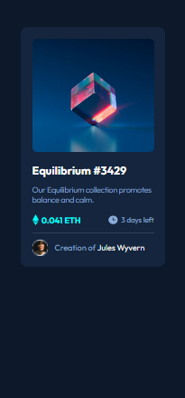
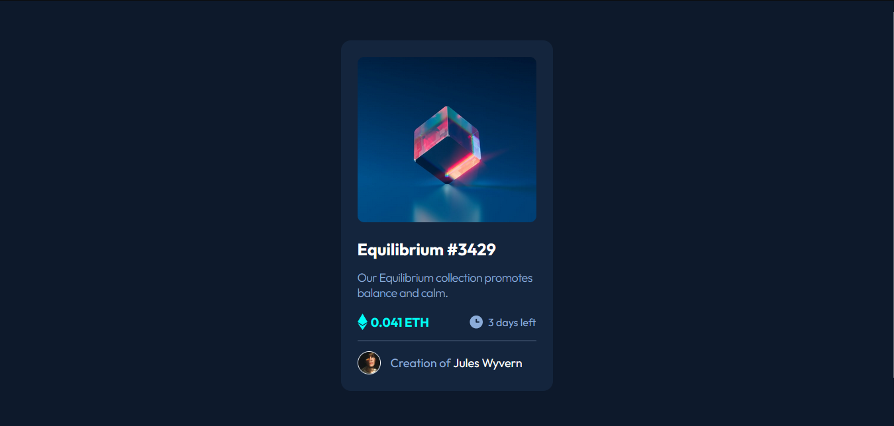

# Frontend Mentor - NFT preview card component solution

This is a solution to the [NFT preview card component challenge on Frontend Mentor](https://www.frontendmentor.io/challenges/nft-preview-card-component-SbdUL_w0U). Frontend Mentor challenges help you improve your coding skills by building realistic projects. 

## Table of contents

- [Overview](#overview)
  - [The challenge](#the-challenge)
  - [Screenshot](#screenshot)
  - [Links](#links)
- [My process](#my-process)
  - [Built with](#built-with)
- [Author](#author)

## Overview

### The challenge

Users should be able to:

- View the optimal layout depending on their device's screen size
- See hover states for interactive elements

## Screenshot

### Mobile

### Deskotop

### Links

- Solution URL: [Frontend Solution](https://www.frontendmentor.io/solutions/nft-preview-card-component-8psnvPTRP-)
- Live Site URL: [Demo](https://juanblancodev.github.io/nft-preview-card-component/)

## My process

### Built with

- Semantic HTML5 markup
- CSS custom properties
- Flexbox
- Mobile-first workflow
- [React](https://reactjs.org/) - JS library
- [Styled Components](https://styled-components.com/) - For styles
- [Axios](https://axios-http.com/)

## Author

- GitHub - [JuanBlancodev](https://github.com/JuanBlancodev)
- Frontend Mentor - [@JuanBlancoev](https://www.frontendmentor.io/profile/JuanBlancodev)
